<div align="center">

# RoadVision AI

### Occlusion-Robust Road Extraction & Graph-Theoretic Criticality Analysis for Urban Mobility

**From satellite pixels to road-network intelligence.**


[Live Demo](#-live-demo) · [Pipeline](#end-to-end-pipeline) · [Model](#segmentation-model) · [Graph Analysis](#-graph-analysis) · [Setup](#-local-setup) · [Limitations](#limitations)

</div>

---

## Overview

Standard road segmentation answers one question: **which pixels are road?**

RoadVision AI is a research-oriented prototype that goes further. It takes a satellite image, extracts the road network with a **custom U-Net trained from scratch**, converts the result into a graph, and uses graph theory to ask structural questions:

- How are the extracted roads connected?
- Which locations are structurally important within the extracted network?
- What happens to connectivity if one of those locations fails?

```text
Traditional segmentation:

    Satellite Image  ->  Road Mask


RoadVision AI:

    Satellite Image  ->  Road Mask  ->  Road Network  ->  Structural Analysis
                     ->  Critical Node  ->  Failure Simulation  ->  Resilience
```

The project combines **deep learning, computer vision, image processing, graph theory, network analysis, and resilience analysis** in a single pipeline, exposed through a FastAPI backend and an interactive research-style dashboard.

> **Scope note.** RoadVision AI is a prototype for studying road-network structure from imagery. It is **not** a production traffic system, does **not** predict real-world traffic, and makes **no claim of GIS-grade accuracy**.

---

## 🌐 Live Demo

> Deployment in progress.

<!-- When deployed, replace the line above with:
[Launch RoadVision AI](LIVE_URL)
-->

---

## 🖥️ Dashboard

<!-- Add dashboard screenshot here -->

---

## End-to-End Pipeline

```mermaid
flowchart LR
    A[Satellite Image] --> B[U-Net Road Segmentation]
    B --> C[Binary Road Mask]
    C --> D[Skeletonization]
    D --> E[Road Graph Construction]
    E --> F[Graph Metrics]
    F --> G[Betweenness Centrality]
    G --> H[Critical Node Identification]
    H --> I[Failure Simulation]
    I --> J[Resilience Analysis]
    J --> K[Interactive Web Dashboard]
```



| Stage | Input | Output | Purpose |
|---|---|---|---|
| Segmentation | RGB satellite image | Road probability map | Predict road likelihood per pixel |
| Thresholding | Probability map | Binary road mask | Separate road from non-road |
| Skeletonization | Binary mask | Thin centerline | Remove thickness, keep topology |
| Graph construction | Skeleton | Graph (nodes, edges) | Represent connectivity explicitly |
| Graph metrics | Graph | Node/edge counts, components | Describe network structure |
| Betweenness centrality | Graph | Per-node score | Rank structural importance |
| Failure simulation | Graph + critical node | Graph after removal | Model a disruption |
| Resilience analysis | Before/after graphs | Comparative metrics | Quantify the impact |

---

## 🛰️ Road Extraction

<!-- Add input/output screenshot here -->

---

## Segmentation Model

### Architecture

RoadVision AI uses a **custom U-Net, implemented and trained from scratch** for binary road segmentation. The architecture is written in PyTorch (`src/models/`) and the weights were learned on road-segmentation data rather than initialized from a pretrained backbone. It maps a 3-channel RGB input to a 1-channel road probability output, which is then converted to a binary road mask.

```text
Input RGB image (3 channels)
        |
        v
   ENCODER
     3  ->  64
    64  -> 128
   128  -> 256
   256  -> 512
        |
        v
  BOTTLENECK
    512 -> 1024
        |
        v
   DECODER
   1024 -> 512
    512 -> 256
    256 -> 128
    128 ->  64
        |
        v
  Final layer: 64 -> 1  (road probability)
```

The model has approximately **31 million trainable parameters**. Skip connections link encoder and decoder stages.

### Why U-Net?

- **The task is pixel-level semantic segmentation.** The pipeline needs the exact road pixels, not a bounding box or an image-level label.
- **Encoder-decoder design.** The encoder captures semantic context; the decoder restores spatial resolution.
- **Skip connections preserve spatial detail.** This is useful for thin, long, connected structures such as roads.
- **Practicality.** U-Net is a good fit for this project's scope and computational constraints, and it can be built and trained end to end without relying on external pretrained models.

This is a design choice for this project, not a claim that U-Net outperforms other segmentation architectures such as DeepLab or SegFormer. No such comparison is made here.

### Training Data & Occlusion Robustness

The model was trained from scratch. Satellite-road datasets used during development include the **Massachusetts Roads Dataset** and **DeepGlobe-related experiments**.

Training experiments introduced **synthetic occlusions** to encourage the model to recover road structure when parts of a road are visually hidden:

| Synthetic occlusion type | Description |
|---|---|
| Cloud-like | Large soft regions obscuring the image |
| Tree / obstacle-like | Local blockages over road areas |
| Shadow-like | Darkened regions imitating shadows |
| Targeted | Occlusions centered around road pixels |

Several experiments and model versions were produced during development.

### Checkpoints

| Checkpoint | Role |
|---|---|
| `ROADVISION_FINAL_BEST.pth` | **Checkpoint used by the final project** |
| `ROADVISION_FINAL_TARGETED.pth` | Previously backed-up checkpoint (not the one used) |
| `best_model_v1_256.pth` | Earlier model file present in `src/models/` |

> Please do not confuse `ROADVISION_FINAL_BEST.pth` (used) with `ROADVISION_FINAL_TARGETED.pth` (backup).

<!-- Note: if checkpoint files are not committed to the repository (e.g., due to size), add download/setup instructions here. -->

### Evaluation

| Metric | Value | Context |
|---|---|---|
| Dice | ≈ 0.7454 | Development / internal benchmark |
| IoU | ≈ 0.5954 | Development / internal benchmark |

> These figures come from internal development evaluation. They are **not** guaranteed real-world accuracy and should not be read as representative of every geographic region, sensor, or imaging condition. No other metrics (precision, recall, F1, mAP) are reported.

---

## 🕸️ Graph Analysis

### Skeletonization

Predicted road regions can be several pixels thick. **Skeletonization** thins them to a one-pixel-wide centerline while preserving the topology (how the roads connect).

### Graph Construction

The skeleton is converted into a graph using a **pixel/skeleton-based** representation:

- skeleton pixel locations become **nodes**
- neighboring skeleton pixel locations become **edges**

> This is **not** a conventional GIS intersection graph. A node does not necessarily correspond to a real-world road intersection.

### Graph Metrics

The system computes descriptive statistics of the extracted graph, including:

- number of nodes
- number of edges
- connected components
- connectivity
- overall graph structure

<!-- Add road graph visualization screenshot here -->

---

## Betweenness Centrality

### The simple idea

```text
A ---- B ---- C
       |
       D
```

To get from A to C, from A to D, or from C to D, the shortest route passes through **B**. Because many shortest routes between different parts of the network depend on B, B has **high betweenness centrality**.

### The technical definition

**Betweenness centrality** measures the extent to which a node lies on shortest paths between other pairs of nodes in a graph. Nodes that sit on many such paths receive higher scores.

RoadVision AI uses this metric to identify **structurally important nodes within the extracted network**.

> A high betweenness score indicates structural importance **within the extracted graph**. It is not proof that the corresponding real-world road is the most important road.

---

## 🚨 Critical Node

```text
High betweenness
      |
      v
Many shortest paths depend on this node
      |
      v
Removing it may affect network connectivity
      |
      v
It becomes a candidate for criticality analysis
```

The system selects a node with high structural importance, based on betweenness centrality, as the **critical node** for subsequent analysis. The term refers to criticality **in the extracted graph model**, not to an objectively most critical real-world road.

<!-- Add criticality screenshot here -->

---

## Failure Simulation

After the critical node is identified, the pipeline simulates its failure by removing it from the graph.

```text
BEFORE                      AFTER B FAILS

A ---- B ---- C             A            C
       |
       D                                 D
```

The purpose is to measure how the network changes after a disruption.

---

## 🛡️ Resilience Analysis

The network before and after the simulated failure is compared using:

| Measure | Meaning |
|---|---|
| Baseline connectivity | Connectivity of the original graph |
| Post-failure connectivity | Connectivity after the critical node is removed |
| Connectivity loss | Difference between baseline and post-failure connectivity |
| Resilience-related index | Summary measure of how well the network tolerates the failure |
| Travel-time-related measurements | Simplified, graph-based estimates of travel cost |
| Alternate-route availability | Whether alternative paths remain after the failure |

> Travel-time values rely on **simplified graph assumptions**, not real traffic data. RoadVision AI is **not** a real-time traffic prediction system.

<!-- Add resilience screenshot here -->

---

## Web Dashboard

The frontend is a technical, research / GIS-style dashboard designed to read like a scientific analysis tool rather than a marketing page. The workflow has five stages:

| Step | Stage | Shows |
|---|---|---|
| 01 | **INPUT** | Uploaded satellite image |
| 02 | **EXTRACTION** | Predicted road mask |
| 03 | **GRAPH** | Graph metrics and road graph visualization |
| 04 | **CRITICALITY** | Critical node and its betweenness score |
| 05 | **RESILIENCE** | Baseline vs. post-failure connectivity, connectivity loss, resilience information, route analysis |

---

## Tech Stack

| Layer | Technologies |
|---|---|
| Deep learning | PyTorch (custom U-Net, trained from scratch) |
| Image processing | OpenCV, scikit-image, Pillow, NumPy |
| Graph analysis | NetworkX |
| Backend | Python, FastAPI, Uvicorn |
| Frontend | Research / GIS-style dashboard (`frontend/`) |

---

## Backend

The backend exposes an upload endpoint that receives an image and passes it through the complete processing pipeline. The response includes:

- prediction image
- input preview
- graph metrics
- graph visualization
- criticality information
- resilience information

| File | Role |
|---|---|
| `src/backend/main.py` | FastAPI application entry point |
| `src/backend/routers/upload.py` | Upload endpoint |
| `src/services/image_pipeline.py` | Orchestrates the full pipeline |

Interactive API documentation is generated by FastAPI at `/docs` when the server is running.

---

## Project Structure

```text
Road-Extraction-AI/
│
├── data/
│   ├── datasets/
│   ├── edges/
│   ├── processed/
│   └── uploads/
│
├── learning/
│
├── src/
│   ├── backend/
│   │   ├── main.py
│   │   └── routers/
│   │
│   ├── dataset/
│   │   └── road_dataset.py
│   │
│   ├── image_processing/
│   │
│   ├── models/
│   │   ├── best_model_v1_256.pth
│   │   ├── ROADVISION_FINAL_TARGETED.pth
│   │   ├── ROADVISION_FINAL_BEST.pth
│   │   ├── decoder.py
│   │   ├── double_conv.py
│   │   ├── encoder.py
│   │   └── unet.py
│   │
│   ├── inference/
│   │   └── predict.py
│   │
│   ├── services/
│   │   └── image_pipeline.py
│   │
│   ├── graph/
│   │   ├── graph_engine.py
│   │   ├── graph_visualization.py
│   │   └── stress_test.py
│   │
│   └── training/
│
├── tests/
├── frontend/
├── requirements.txt
├── .gitignore
└── README.md
```

---

## 🚀 Local Setup

### 1. Clone the repository

```bash
git clone https://github.com/nencycodes/road-extraction-ai.git
cd road-extraction-ai
```

### 2. Create and activate a virtual environment

**Windows**

```powershell
python -m venv venv
.\venv\Scripts\activate
```

**macOS / Linux**

```bash
python3 -m venv venv
source venv/bin/activate
```

### 3. Install dependencies

```bash
pip install -r requirements.txt
```

### 4. Run the backend

```bash
python -m uvicorn src.backend.main:app --reload
```

| Resource | URL |
|---|---|
| Backend | http://127.0.0.1:8000 |
| FastAPI docs | http://127.0.0.1:8000/docs |

### 5. Frontend

<!-- Add frontend run instructions here (e.g., how to open or serve the contents of frontend/). -->

---

## Limitations

- **Research prototype.** Not intended for operational, safety-critical, or planning decisions.
- **Trained from scratch.** The U-Net uses no pretrained backbone, so its behavior depends entirely on the datasets and augmentations used during development.
- **Benchmarks are internal.** Dice ≈ 0.7454 and IoU ≈ 0.5954 are development benchmarks and do not guarantee performance on other regions, resolutions, or imaging conditions.
- **Skeleton-based graph.** Nodes are skeleton locations, not verified road intersections; this is not a GIS-grade intersection graph.
- **Structural, not real-world, importance.** Betweenness centrality reflects importance in the extracted graph only.
- **Simplified travel-time model.** Travel-time measurements use simplified graph assumptions, not real traffic data.
- **No traffic prediction.** The system does not predict traffic or model real-time conditions.
- **Segmentation errors propagate.** Missed or spurious road pixels affect the skeleton, graph, centrality scores, and resilience results.
- **Synthetic occlusions.** Robustness experiments used synthetic occlusions, which may not reflect all real-world occlusion patterns.

---

## Roadmap

- [ ] Public deployment of the web application
- [ ] Dashboard screenshots in this README
- [ ] Frontend setup instructions

---

## Author

**nencycodes**
GitHub: [@nencycodes](https://github.com/nencycodes)
Repository: [nencycodes/road-extraction-ai](https://github.com/nencycodes/road-extraction-ai)

---

<div align="center">

*RoadVision AI — from satellite pixels to road-network intelligence.*

</div>
